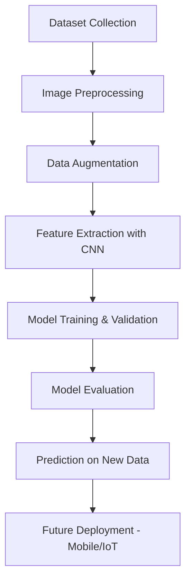

# 🍊 Citrus Fruits and Leaves Disease Detection

## 📌 Project Overview

Citrus fruits are one of the most important commercial crops worldwide, but their production is highly affected by various **leaf and fruit diseases**. Manual identification of diseases is time-consuming and requires expert knowledge.

This project provides an **automated machine learning solution** for detecting and classifying citrus fruit and leaf diseases. By leveraging **image processing** and **deep learning techniques**, the model can distinguish between **healthy** and **diseased** plants, assisting farmers, researchers, and agricultural organizations in early detection and effective management.

**Published Research:**
This project has been peer-reviewed and published in the Journal of Information Systems and Emerging Management (JISEM).

Title: Design of Automated Model for Citrus Fruits and Leaves Disease Detection

Journal: Journal of Information Systems and Emerging Management (JISEM)

Year: 2025

https://jisem-journal.com/index.php/journal/article/view/6417/2968

---

## 🎯 Objectives

* Develop a **robust automated model** for citrus disease detection
* Reduce dependency on manual inspection by **agriculture experts**
* Use **deep learning (CNN)** for high-accuracy classification
* Enable future integration with **mobile/IoT devices** for real-time disease detection

---

## 🛠️ Tech Stack

* **Programming Language:** Python
* **Libraries:**

  * TensorFlow / Keras – for deep learning model
  * OpenCV – for image preprocessing
  * NumPy & Pandas – for numerical operations
  * Matplotlib / Seaborn – for visualization
* **Tools:** Jupyter Notebook / Google Colab

---

## 📂 Dataset Information

* The dataset consists of **images of citrus leaves and fruits**.
* Categories include:

  * **Healthy** leaves/fruits
  * **Diseased** leaves/fruits (affected by bacterial/fungal infections)
* Preprocessing steps applied:

  * Image resizing & normalization
  * Data augmentation (rotation, flipping, zooming)
  * Noise reduction for better feature extraction

---

## ⚙️ Workflow

---

## 🚀 How It Works

1. **Dataset Preparation**
   * Images are collected, cleaned, and divided into training, validation, and testing sets.

2. **Image Preprocessing**
   * Images are resized to a fixed dimension (e.g., 128x128).
   * Normalization scales pixel values between 0–1.
   * Augmentation increases dataset size and improves model generalization.

3. **Model Development**
   * A **Convolutional Neural Network (CNN)** is built for feature extraction and classification.
   * Layers include Convolution, Pooling, Dropout, and Fully Connected layers.

4. **Training & Evaluation**
   * Model is trained on the processed dataset.
   * Accuracy, loss curves, and confusion matrix are plotted.

5. **Prediction**
   * Given a new citrus leaf or fruit image, the model predicts whether it is **healthy** or **diseased**.

---

## 📊 Results

* The model achieved **high classification accuracy** on the test dataset.
* Performance metrics used:

  🍊 Citrus Fruits  
      &nbsp; &nbsp; &nbsp; ✅ Accuracy: 95%  
      &nbsp; &nbsp; &nbsp; 🎯 Precision: 95%  
      &nbsp; &nbsp; &nbsp; 🔄 Recall: 95%  
      &nbsp; &nbsp; &nbsp; 📐 F1-Score: 95%  

  🌿 Citrus Leaves  
      &nbsp; &nbsp; &nbsp;✅ Accuracy: 99%  
      &nbsp; &nbsp; &nbsp;🎯 Precision: 99%  
      &nbsp; &nbsp; &nbsp;🔄 Recall: 99%  
      &nbsp; &nbsp; &nbsp;📐 F1-Score: 99%  

### 📊 Visualization:

* Accuracy/Loss curves demonstrate stable training and strong generalization.
* Confusion matrices (for both fruits and leaves) show minimal misclassification.
* The model proves effective for early disease detection in both citrus fruits and leaves.

---

## 🔮 Future Enhancements

* Expand dataset with more citrus varieties and disease classes
* Implement **real-time mobile app** for farmers
* Cloud deployment for large-scale monitoring
* Use **transfer learning** with pretrained models (ResNet, MobileNet) for higher accuracy

---

